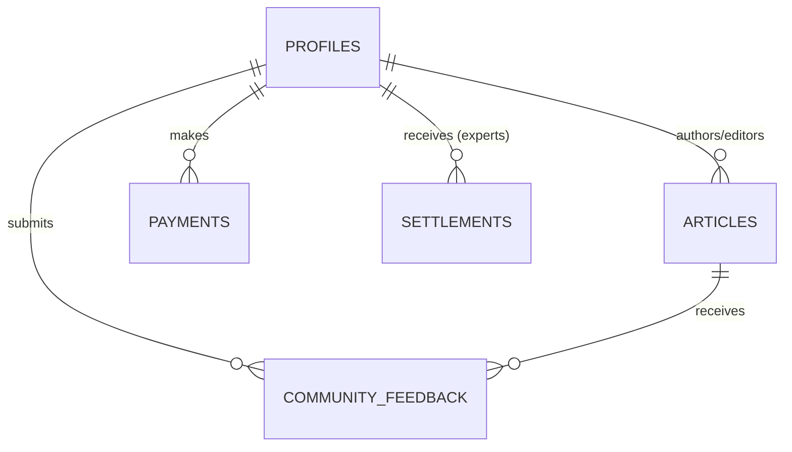

# Phase 1: Schema & Terminology Definition
> KoreaStartup.kr Core Data Models

## Purpose
Define the shared vocabulary and data structure for the news curation, community feedback, and expert monetization system.

## 1. Terminology Glossary

| Term | Definition | Example |
|------|------------|---------|
| User | Registered account via Kakao/Google Auth | user@gmail.com |
| Role | Authorization level (super_admin, editor, expert, user) | editor |
| Article | Curated startup news piece with AI metadata | "Toss Funding News" |
| Snippet | 5-line AI-generated summary | "Toss raised $100M..." |
| Feedback | Community tag on articles (Debate, Fact-check, etc) | "Fact-check: Date wrong" |
| Settlement | Monthly revenue calculation for experts | 2026-03 Settlement |

## 2. Entity Definitions

```typescript
type UserRole = 'super_admin' | 'editor' | 'expert' | 'user';

interface Profile {
  id: string; // UUID from Auth
  role: UserRole;
  nickname: string;
  created_at: Date;
}

interface Article {
  id: string; // UUID
  source_url: string;
  source_name: string; // e.g., 'VentureSquare'
  title: string;
  content_raw: string; // Clutter-free markdown (Jina Reader)
  summary_5lines: string; // AI generated
  og_image_url?: string;
  published_at: Date;
  created_at: Date;
}

interface CommunityFeedback {
  id: string; // UUID
  article_id: string;
  user_id: string;
  tag: 'Additional Info' | 'Debate' | 'Counter-argument' | 'Fact-check' | 'General';
  content: string;
  created_at: Date;
}

interface Payment {
  id: string; // UUID
  user_id: string;
  amount: number;
  toss_order_id: string;
  status: 'PENDING' | 'DONE' | 'CANCELED';
  created_at: Date;
}

interface Settlement {
  id: string; // UUID
  expert_id: string; // user_id with 'expert' role
  month: string; // YYYY-MM
  total_revenue: number;
  platform_fee: number; // 20%
  net_payout: number;
  status: 'PENDING' | 'PAID';
  created_at: Date;
}
```

## 3. Relationship Diagram



## Next Step
- Create SQL Migrations in Supabase.
- Proceed to Phase 2: Convention.
